#   Adding OCI Template #
## Overview ##

CloudLabs Template is the base of the Hands-on-Lab environment. You can do a variety of configurations under Templates such as adding pre-requisites, enabling roles and policies for users, and much more.

Here we will learn more about how to work with CloudLabs Template.

## Add Template ##

1. Navigate to Templates section that is available in the left menu and click on **+ ADD** button given in the top right corner.

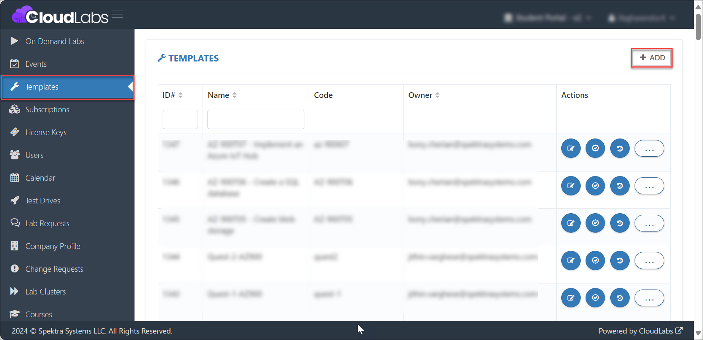

2. For your convenience, this page is divided into three sections:

A. The fields and their functionality are listed below:

- **Name:** To identify the lab, give a name to the Template.

- **Cloud Platform:** CloudLabs supports four cloud platforms - Oracle Cloud Infrastructure, Microsoft Azure, Amazon Web Services & Google Cloud Platform. Based on your lab requirements you can pick a cloud platform from the drop down.

- **Cloud Resource Usage:** This feature helps the system in calculating the cost of a Virtual Machine or the total cost of all Cloud resources. You can select any option from the drop-down menu, but we recommend selecting Cloud Resource Usage.

- **Code:** Use a code as an internal identifier; this code will also be concatenated in the name of the user Compartment. As an example, if you use the code demolab, you'll be able to tell that the template is about a demo lab. The user's Compartment will be named ODL-demolab-xxxxxx, where demolab is a lab code, ODL is the default prefix, and xxxxx is the CloudLabs-assigned user unique ID.

- **Subscription Type:** This option is only available if you go for **Microsoft Azure** cloud platform. For  **Oracle Cloud Infrastructure, Amazon Web Services & Google Cloud Platform**, it will be taken care of automatically.

    CloudLabs provides only Dedicated Subscription for Oracle Cloud Infrastructure.

    -   **Dedicated Subscription** - Dedicated subscription is used when a lab requires subscription level access. Here, each user gets access to a single subscription.

-   **Description:** Provide a brief description to describe your lab, its resources and technologies as well as its learnings and benefits. It will be visible to the end users as well.

-   **Lab Launch Page Description:** Lab Launch page is basically where you launch your lab environment. You can add any additional instructions to this page that you think are relevant for the users.

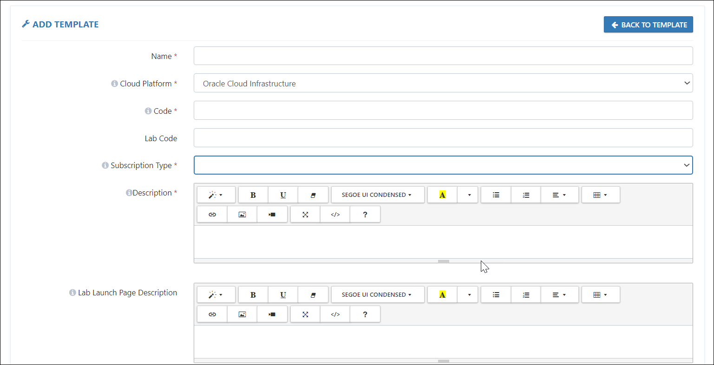

B. Moving on to next section, we will learn about the fields listed below:

-   **Custom Page Title:** In case you want to customize the title of the Hands-on-Lab Registration page, you can provide a title in this field.

-   **Custom Logo URL:** In case you want to customize the logo of the Hands-on-Lab Registration page, you can provide the URL of logo in this field.

> **Note:** The default page title and logo will be displayed, but if you wish to change them, you can use this field. End-users will be able to see it on the Hands-on Lab registration page, allowing you to customize what you want them to see.

-   **Owner Email:** In this field you have to provide Email address of the person who is responsible to build the Template.

-   **Reviewed By:** This field can be used to have reviewer information who will be reviewing the template configurations.

- **Lab Guide URL:** A lab guide is a document that gives users all of the directions they need to complete a hands-on lab. The Lab guide URL can be entered here, and it will appear on the users' lab details page. The lab guide will be available to them once they have accessed the URL.

-   **Help Document URL:** If you want to provide users with a help manual that will assist them in completing the lab, you can place that document URL here.

-   **Prerequisites URL:** If you wish to give people visibility into how the lab is set up or how the pre-requisites for the lab are defined, you may write a document and enter the URL here.

    >**Note** To allow the URLs to be entered here, all documents should be in GitHub or PDF format. The users will be able to access these documents by just clicking on the URLs.

-   **Github Master Document file URL:** This is a JSON-formatted document that is used to arrange the lab guide to a coherent way. We should first prepare the document in JSON format, with section-by-section raw GitHub URLs, as it only supports GitHub raw URLs. 

A master document contains the following information:

1. **Name:** Here you have to provide a name for your Lab.
2. **Language:** English
3. **Files:** In this section we provide the Raw File Path and Order of the file lab guide that should be available in GitHub.
    -   **Raw File Path:** This is the raw URL of the pages in your lab guide.
    -   **Order:** Defines the sequence of the pages in your lab guide such as what all should come first and so on.

Example: You have a lab guide in GitHub which includes - Introduction to the Lab, three Exercises to be performed, and a Summary. Rather than preparing one lengthy document, we'll break it down into individual pages on GitHub and fetch the Raw URL for each page. We will add the Raw URL of the pages in Raw File Path, with respect to the order value.

Therefore, the lab guide's final output will follow the flow shown below:

-   Introduction of the Lab
-   Exercise 1
-   Exercise 2
-   Exercise 3
-   Summary
For your reference, here is a Master document sample -

https://cloudlabsai.blob.core.windows.net/master-doc/master-doc.json

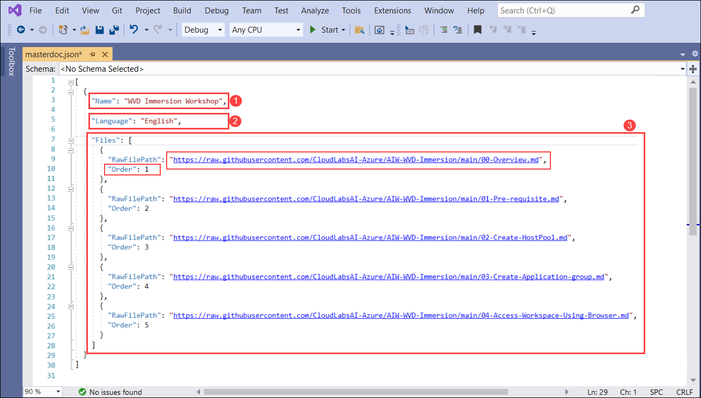

-   **Approx. Deployment Duration:** Your environment's pre-requisite resources will take some time to deploy. The expected deployment duration will be defined throughout this time period. The period you enter in this area will be displayed to users as a countdown to the start of the Lab.

-   **Region:** Here you can choose **US-ashburn-1** for your resource deployments. The selected region will automatically get reflected in the Lab setup.

-   **Excluding Output Parameters:** In this option, we can specify any output parameters that need to be excluded from the ‘Environment Details’ tab.

-   **Control Panel Resources:** Here we can mention the resources that will be visible in the Control Panel.

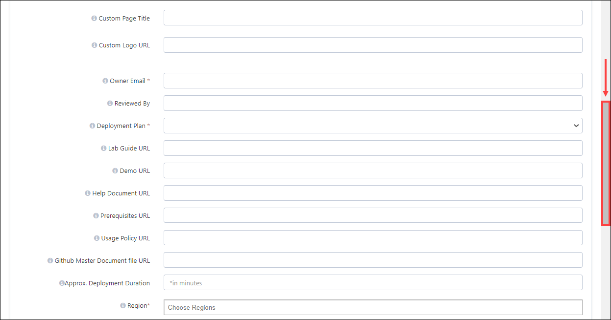

C. In the last section, we will learn about the features that can be enabled:

-   **Enable Lab Validation:** Lab validation enables you to check whether lab tasks are completed appropriately. In case the user had issues performing the lab, that can be checked under validations.

-   **Show Resources Tab:** This option allows you to display VM operations in the attendee ‘Environment Resource’ page.

3.  At last, click on the **SUBMIT** button to save all the configurations.

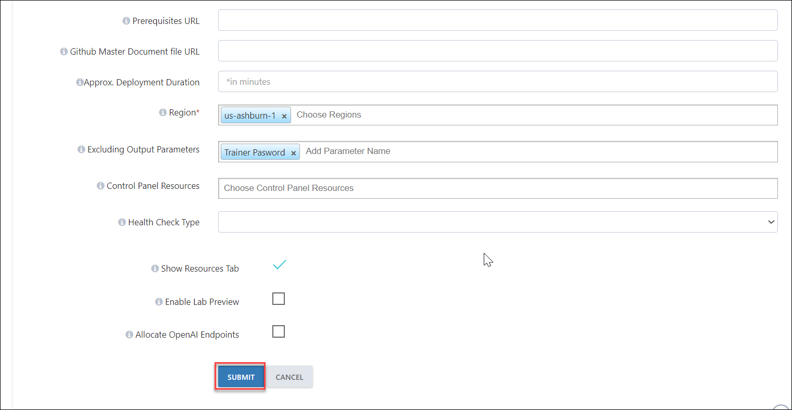

4.  Once you've submitted the template, you'll be directed to the main Template page, where the template you created will be listed as shown in the image below. Now you have to reopen the template to configure other available functionalities, so click on the **Edit** button.

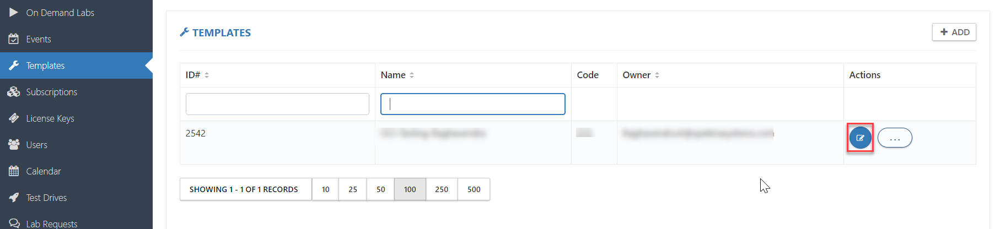

5.  Here you will have access to the following functionalities in order to fully configure a CloudLabs Template:

-   Terraform Template

-   Template Permissions

-   Custom Handlers

-   Deployment Script Repository

-   Virtual Machine Configuration

-   Course Details

-   Template Lab Asset

-   Template Audit

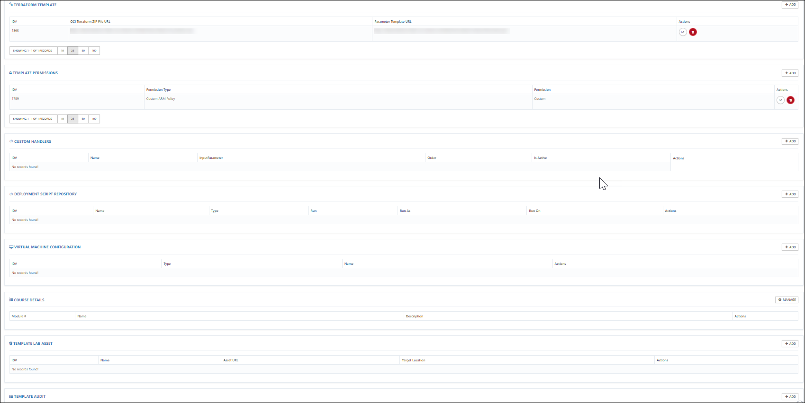

6.  Now we'll have a look at each of the features to understand how they work.

##  Terraform Template ##
As the name suggests, you will provide the Terraform template files here to provision your lab environment.

-   **Terraform template file:** The Terraform Template is a HashiCorp Configuration Language (HCL) file that outlines your project's infrastructure and settings. The resources required for deployment, as well as their properties, must be specified in the template.

A Terraform Template has the following sections:

-   **Parameters** - In the parameters section of the template, you specify which values you can input when deploying the resources.

-   **Variables** - In the variables section, you construct values that can be used throughout your template. You don't need to define variables, but they often simplify your template by reducing complex expressions.

-   **Resources** - In the resources section, you define the resources that are deployed.

 -  **Outputs** - In the outputs section, you specify values that are returned from deployment. Typically, you return values from resources that were deployed.

 For your reference, here is a sample Terraform Template:
 
 https://idlecheckfeature.blob.core.windows.net/idlecheckcontainer/Linuxinstance.zip

 -  **Parameter file:** Rather than passing parameters as inline values in your Terraform Template, you can use a JSON file that contains the parameter values. The parameter names in the parameter section of your Terraform template and Parameter file must match.

 For your reference, here is a parameter file sample:

https://idlecheckfeature.blob.core.windows.net/idlecheckcontainer/InstanceParameters.json

To learn more about the Terraform Template, check [Create and deploy your first Terraform Template.](https://docs.oracle.com/en-us/iaas/developer-tutorials/tutorials/tf-compute/01-summary.htm)

Follow the steps below to get started:

1.  Click on the **+ ADD** button.

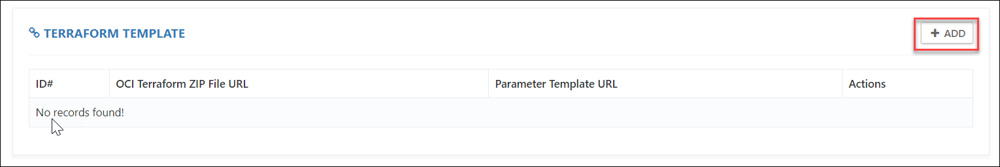

2.  Fill up the below sections:

-   **Terraform Template URL:** Add the Terraform zip file URL here.

-   **Parameter Template URL:** Add the parameter file URL here.

-   Click on **SUBMIT** to save the configurations.

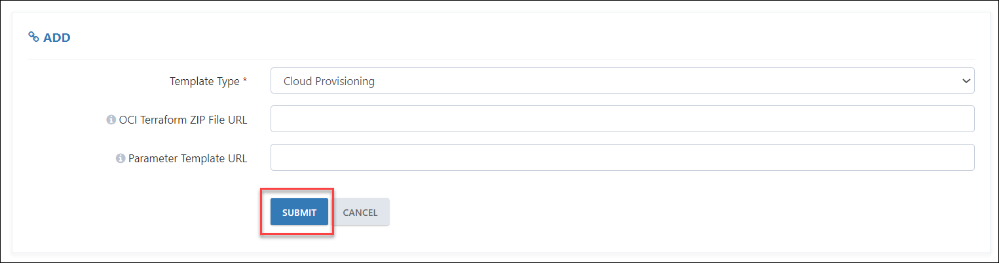

## TEMPLATE PERMISSIONS  

To provide access to various OCI services you assign custom permissions. Template permissions allow you to control who has access to OCI resources, along with what they can do with them and what areas they may access.

Here are some examples of what you can do with template permissions:

1. Allow a user to create and manage OCI resources like Object Storage, Compute instances, and Autonomous Databases with limited or full access to these resources.

2. Allow users to create and manage users, groups, and attach policies to control access within the OCI environment.

Now we will learn how to assign permissions on the CloudLabs Template.

1. Click on the + **ADD** button.

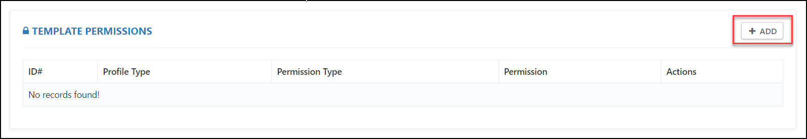

>**Note:** If you have pre-deployed ODLs, [click here](https://docs.cloudlabs.ai/LabDeveloper/AddPermissionsonDeployedODL) to view the steps on how to apply these permissions.

2. Now fill up the following sections:

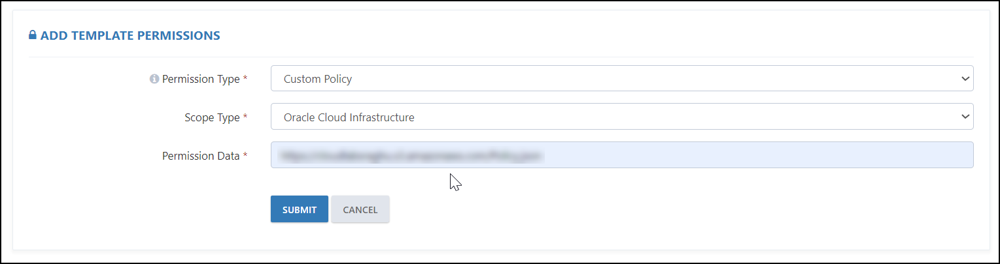

-   **Permission Type:** Select Custom policy as OCI allows only Custom policies.

-   **Scope Type:** Choose Oracle Cloud Infrastructure.

-   **Permission Data:** Here we can provide the link to the custom policy created to grant access to various Oracle Cloud Infrastructure (OCI) services.

Sample OCI Custom Policy for reference: https://idlecheckfeature.blob.core.windows.net/idlecheckcontainer/PolicyTemplate.json

-   At last, click on the **SUBMIT** button to save it.
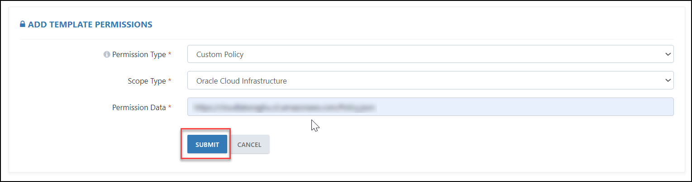

> **Note:** The Custom Policies are to be built in JSON (JavaScript Object Notation) format and stored in an Object Storage bucket in Oracle Cloud Infrastructure (OCI), where the bucket and objects are set to be publicly accessible.

##  Deployment Handlers

This feature allows you to pre-deploy some resources, like Key-Pair & Default VCN.

Take the steps below to get started:

1.  Click on the + **ADD** button.

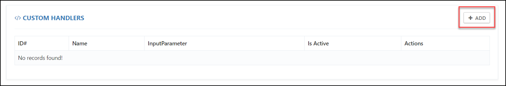

3. In the Add Custom Handler Association, select the custom handler for the resource that you want to pre-deploy.

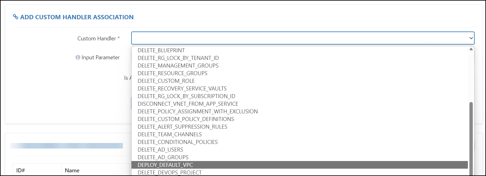

4.  In the Input Parameter, provide a JSON file containing the details of the region where the resource is to be deployed.

5. Check the checkbox next to the **IsActive** parameter, and click on the **Submit** button.

##  Best Practices: Adding OCI Templates
1.  It is recommended that you provide the **Description** at the template level so that whenever you create multiple ODLs from the same template, you do not need to add a description at each ODL level; it is automatically configured.

2.  Add **Owner Email** to identify the person responsible for building the template, so that whenever there is an issue with the template configurations or while accessing the lab environment, you can reach out to the template owner.

3.  Usage Policy URL and GitHub Mater Document URL must be in JSON format.

4.  Make sure to follow the below format while creating a GitHub Master Document:

    -   Name: Here you must provide a name for your Lab.

    -   Language: English

    -   Files: In this section we provide the Raw File Path and Order of the file lab guide that should be available on GitHub.

    -   Raw File Path: This is the raw URL of the pages in your lab guide.

    -   Order: Defines the sequence of the pages in your lab guide, such as what should come first and so on.

5.  Choose OCI regions where you want to have the OCI resource deployments to avoid any service or SKU quota issues. It is recommended that you deploy the VM in the same OCI region and use the nearest region to avoid the latency.
6.  The Terraform template and the parameter file must be saved as .json or .tf, for example:

    -   Template: deploy01.zip

    -   Parameter File: parameters01.json

7.  While configuring the deployment handler, ensure that the formatting is correct & the format in which the deployment handler configuration file is created is JSON.

